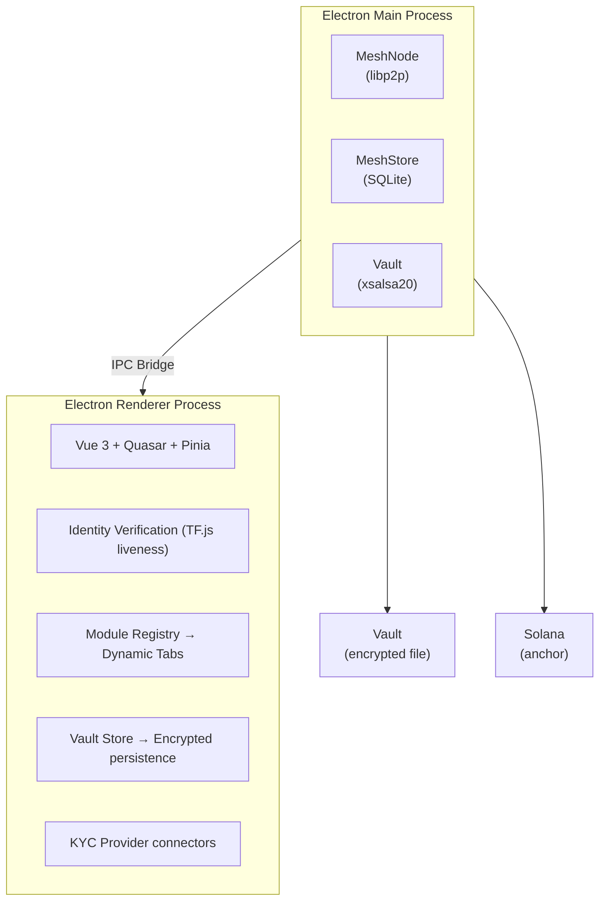
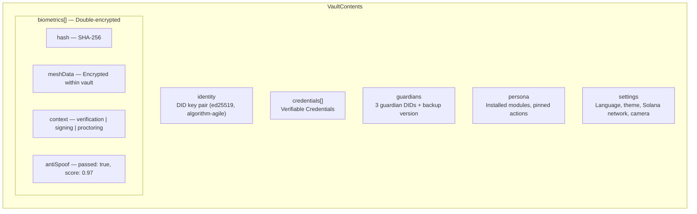

# attestto-desktop

> Open-source Electron app that turns every computer into a node in a national identity mesh. Citizens, lawyers, notaries, and government officials verify identity, manage verifiable credentials, sign documents, and contribute storage to the distributed infrastructure.

Attestto Desktop is an open-source Electron application enabling citizens, lawyers, notaries, and government officials to verify identity, manage verifiable credentials, sign documents, and participate in a distributed storage network. Every installation contributes configurable storage (default 250 MB) to a peer-to-peer mesh, hosting encrypted identity data it cannot read — the Blind Courier principle. In return, the user's identity state is replicated across 50+ peers, ensuring availability even when government servers are offline.

---

## Architecture



| Layer | Technology | Purpose |
|:------|:-----------|:--------|
| **Main Process** | Node.js + @attestto/mesh | P2P networking, storage, vault encryption |
| **Renderer** | Vue 3, Quasar, Pinia | Adaptive UI, identity verification, module system |
| **Vault** | xsalsa20-poly1305 + safeStorage | Private keys, credentials, biometric proofs |
| **Mesh Store** | SQLite + .enc files | Encrypted blobs from other citizens (Blind Courier) |
| **Guardians** | Shamir 2-of-3 + mesh | Social recovery shards distributed via P2P |
| **Anchor** | Solana | Immutable proof-of-existence timestamps |

---

## Core Systems

### Encrypted Vault
- **Passkey-style authentication** — OS keychain (`safeStorage`) + biometric (Touch ID) — no passwords
- **Algorithm-agile envelope** — `cryptoSuite` field enables post-quantum migration without breaking existing vaults
- **xsalsa20-poly1305** encryption with scrypt KDF
- **15-minute auto-lock** with biometric re-authentication
- Vault holds: identity keys, verifiable credentials, biometric proofs, settings, persona

### Identity Verification (Plugin Architecture)
- **Biometric liveness** (built-in, universal) — TensorFlow.js face mesh, 100% local processing, anti-spoofing
  - Voice-guided challenge flow: center face → look left → look right → look up → blink
  - Web Speech API narration with pre-recorded audio support
  - Biometric captures stored double-encrypted in vault (encrypted inside encrypted vault)
  - Hash-based audit trail — auditors verify existence without seeing raw data
- **Document verification** (country plugin slot) — each country implements its own ID types (cedula, DNI, passport)
- **KYC provider connectors** — Sumsub, Onfido, Jumio integration slots
- All verification paths produce the same output: a **Verifiable Credential** stored in the local vault

### Social Recovery (Shamir 2-of-3)
- **Encrypt-then-split** — vault is encrypted with passkey-derived key, then split into 3 shards via Shamir Secret Sharing
- Shards distributed to **3 guardians** via the P2P mesh
- **Recovery**: 2 shards + biometric → reconstruct vault on new device
- Guardians hold opaque encrypted blobs — two colluding guardians can't read your data without your device
- Shamir splitting is information-theoretically secure (quantum-safe)

### P2P Mesh Node
- Each desktop app is a node in the distributed identity mesh via [`@attestto/mesh`](https://github.com/Attestto-com/attestto-mesh)
- **Auto country detection** via system timezone → joins the correct national mesh
- Mesh protocol: PUT/GET/TOMBSTONE for encrypted blobs
- Gossip-based revocation — tombstones propagate in <500ms
- **Offline verification** — verify credentials and signed documents without internet

### Module System
- **Universal core** + **country-specific modules** from independent registries
- Core auto-updates via GitHub Releases; country modules update from per-country registries
- Modules stored in `{userData}/modules/{moduleId}/` with manifest + payload
- Three-tier registry:
  1. **Core modules** — governed, audited, part of the base (`@attestto/proctor`, `@attestto/sign`, `@attestto/verify`)
  2. **Country modules** — each country's registry is independent (e.g. `registry.attestto.cr/modules.json`)
  3. **Third-party modules** — hospitals, banks, universities can publish to their own registries
- Every module inherits the security sandbox: scoped API surface, no raw key access

---

## Biometric Vault Data Model



**Audit flow**: Routine audit sees `LivenessProof` VC with hash only. Disputed audit: user consents to reveal raw mesh → auditor verifies hash matches. Court order: guardian recovery → authorized access under legal process.

---

## Theming

The entire UI is controlled by CSS custom properties. To retheme for a different country or institution:

```scss
:root {
  --att-primary: #10b981;      // Change this one value
  --att-primary-dark: #0d9488;  // And this
  // Everything else derives from these
}
```

Quasar brand colors in `main.ts` must match. Typography uses a `rem`-based scale (`--att-text-xs` through `--att-text-2xl`) — the accessibility font size control scales everything proportionally.

---

## Quick start

### Prerequisites

- Node.js >= 20
- pnpm
- [`attestto-mesh`](https://github.com/Attestto-com/attestto-mesh) cloned as a sibling directory

### Install

```bash
# Clone both repos side by side
git clone https://github.com/Attestto-com/attestto-desktop.git
git clone https://github.com/Attestto-com/attestto-mesh.git

# Install mesh first (native deps)
cd attestto-mesh && pnpm install && pnpm build && cd ..

# Install desktop
cd attestto-desktop
pnpm install
```

### Try it / Run

```bash
# Development mode
pnpm dev

# Build for distribution
pnpm dist:mac     # macOS (.dmg)
pnpm dist:win     # Windows (.exe)
pnpm dist:linux   # Linux (.AppImage)

# Testing
pnpm test         # Run 27 tests
```

---

## Project Structure

```
src/
├── main/                    ← Electron main process
│   ├── index.ts             ← App entry, lifecycle, IPC registration
│   ├── mesh/                ← P2P mesh integration
│   │   ├── service.ts       ← MeshService singleton, auto country detection
│   │   └── ipc.ts           ← IPC handlers for mesh operations
│   ├── vault/               ← Encrypted vault + social recovery
│   │   ├── vault-service.ts ← Encrypt/decrypt, safeStorage, auto-lock
│   │   ├── vault-ipc.ts     ← IPC handlers for vault operations
│   │   ├── guardian-service.ts ← Shamir split/combine + mesh shards
│   │   └── guardian-ipc.ts  ← IPC handlers for guardian operations
│   ├── modules/             ← Country module loader
│   └── updater/             ← Core auto-updater (GitHub Releases)
│
├── preload/                 ← Context bridge (main ↔ renderer)
│
├── shared/                  ← Shared types (IPC contracts)
│   ├── mesh-api.d.ts        ← Mesh, update, module API types
│   └── vault-api.d.ts       ← Vault, guardian, biometric types
│
└── renderer/                ← Vue 3 application
    ├── views/               ← Pages
    │   ├── VaultUnlockPage  ← Lock screen with Attestto branding
    │   ├── IdentityPage     ← Liveness + document + KYC verification
    │   ├── SettingsPage     ← Two-column: identity/security + preferences
    │   ├── HomePage         ← Profile completion, quick actions, modules
    │   ├── CredentialsPage  ← Verifiable credential wallet
    │   ├── GuardianSetupPage← Social recovery configuration
    │   └── RecoveryPage     ← Vault recovery via guardians
    ├── components/          ← Reusable UI components
    ├── stores/              ← Pinia stores (vault, persona, mesh)
    ├── composables/         ← Vue composables (useCamera)
    ├── registry/            ← Module manifests and defaults
    ├── router/              ← Routes + vault lock/unlock guards
    └── assets/              ← Global SCSS with design tokens
```

---

## Key Concepts

**Station vs. Wallet:** The desktop app is the **"Station"** — where the heavy lifting of democracy happens: signing deeds, verifying multi-page medical records, and auditing the mesh. The mobile PWA (planned) is the **"Wallet"** for everyday credential presentation.

**Blind Courier:** Every installation contributes configurable storage to the P2P identity mesh, hosting encrypted identity data it cannot read. In return, the user's own identity state is replicated across 50+ peers.

**Mesh-Based SSL Trust:** The same mesh infrastructure can replace centralized Certificate Authority (CA) lookups via Trust Fingerprints (SHA-256 of valid SSL certs, gossiped via mesh), Gossip Revocation (tombstones propagate in <500ms), Zero-Knowledge Privacy (query cert status without the CA knowing which sites you visit), and Sovereign Trust (national trust anchors eliminate dependency on foreign CAs).

---

## Ecosystem

| Repo | Role | Relationship |
|:-----|:-----|:-------------|
| [`attestto-mesh`](https://github.com/Attestto-com/attestto-mesh) | P2P Data Layer | Core dependency — libp2p/DHT/GossipSub networking and encrypted blob storage |
| [`did-sns-spec`](https://github.com/Attestto-com/did-sns-spec) | Identity Specification | DID method for Solana Name Service — identity anchoring standard |
| [`cr-vc-schemas`](https://github.com/Attestto-com/cr-vc-schemas) | Credential Schemas | Verifiable Credential schemas for Costa Rica use cases |
| [`attestto-verify`](https://github.com/Attestto-com/attestto-verify) | Document Verification | Web components for in-app credential and document verification |
| [`id-wallet-adapter`](https://github.com/Attestto-com/id-wallet-adapter) | Wallet Integration | Wallet discovery and credential exchange protocol |

---

## Build with an LLM

This repo ships a [`llms.txt`](./llms.txt) context file — a machine-readable summary of the API, data structures, and integration patterns designed to be read by AI coding assistants.

### Recommended setup

Use the [`attestto-dev-mcp`](../attestto-dev-mcp) server to give your LLM active access to the ecosystem:

```bash
cd ../attestto-dev-mcp
npm install && npm run build
```

Then add it to your Claude / Cursor / Windsurf config and ask:

> *"Explore the Attestto ecosystem and help me build with [this component]"*

### Which model?

We recommend **[Claude](https://claude.ai) Pro** (5× usage vs free) or higher. Long context, strong TypeScript/Electron reasoning, and Solana familiarity handle this codebase well. The MCP server works with any LLM that supports tool use.

> **Quick start:** Ask your LLM to read `llms.txt` in this repo, then describe what you want to build. It will find the right archetype, generate boilerplate, and walk you through the first run.

---

## Contributing

We welcome contributions. Please open issues for bugs and feature requests. See the related repositories for domain-specific contribution guidelines (mesh protocol, identity schemas, credential verification).

---

## License

[Apache 2.0](./LICENSE) — Use it, fork it, deploy it. No vendor lock-in. No permission needed.

Built by [Attestto](https://attestto.com) as Open Digital Public Infrastructure.
