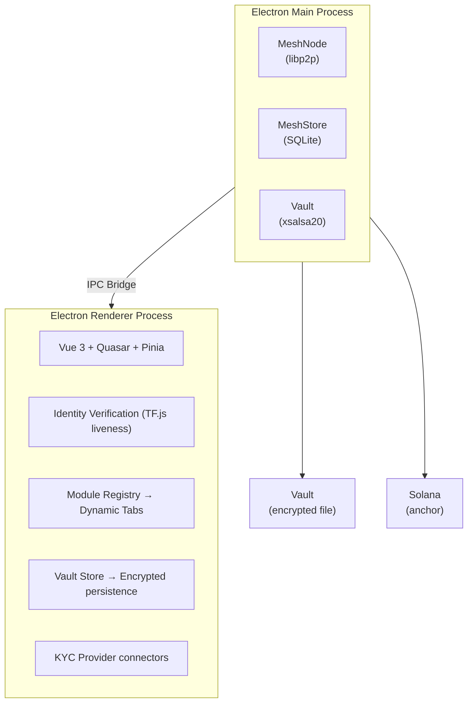
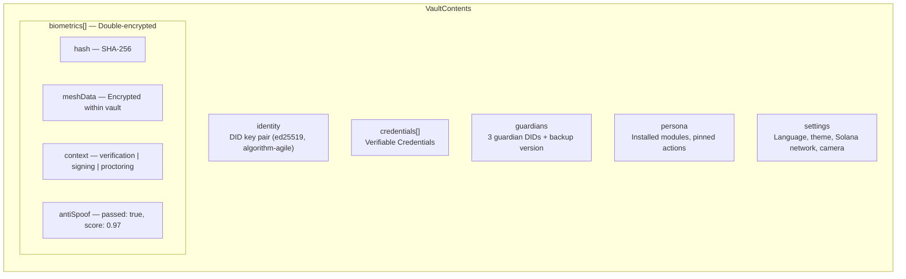

**[English](./README.md)** | [Espanol](./docs/translations/README.es.md)

---

# Attestto Desktop

[](https://github.com/Attestto-com/attestto-desktop/actions/workflows/build.yml)
[](https://github.com/Attestto-com/attestto-desktop/actions/workflows/build.yml)
[](https://github.com/Attestto-com/attestto-desktop/actions/workflows/build.yml)
[](./LICENSE)

**Open Digital Public Infrastructure — Sovereign Identity Station**

Attestto Desktop is an open-source Electron application that turns every computer into a node in a national identity mesh. Citizens, lawyers, notaries, and government officials use it to verify identity, manage verifiable credentials, sign documents, and participate in the distributed storage network that keeps identity infrastructure resilient.

Every installation contributes a configurable amount of storage (default 250 MB) to the peer-to-peer mesh, hosting encrypted identity data it cannot read — the **Blind Courier** principle. In return, the user's own identity state is replicated across 50+ peers, ensuring availability even when government servers are offline.

The desktop app is the **"Station"** — where the heavy lifting of democracy happens: signing deeds, verifying multi-page medical records, and auditing the mesh. The mobile PWA (planned) is the **"Wallet"** for everyday credential presentation.

---

## Core Systems

### Encrypted Vault
- **Passkey-style authentication** — OS keychain (`safeStorage`) + biometric (Touch ID) — no passwords
- **Algorithm-agile envelope** — `cryptoSuite` field enables post-quantum migration without breaking existing vaults
- **xsalsa20-poly1305** encryption with scrypt KDF
- **15-minute auto-lock** with biometric re-authentication
- Vault holds: identity keys, verifiable credentials, biometric proofs, settings, persona

### Identity Verification (Plugin Architecture)
- **Biometric liveness** (built-in, universal) — TensorFlow.js face mesh, 100% local processing, anti-spoofing
  - Voice-guided challenge flow: center face → look left → look right → look up → blink
  - Web Speech API narration with pre-recorded audio support
  - Biometric captures stored double-encrypted in vault (encrypted inside encrypted vault)
  - Hash-based audit trail — auditors verify existence without seeing raw data
- **Document verification** (country plugin slot) — each country implements its own ID types (cedula, DNI, passport)
- **KYC provider connectors** — Sumsub, Onfido, Jumio integration slots
- All verification paths produce the same output: a **Verifiable Credential** stored in the local vault

### Social Recovery (Shamir 2-of-3)
- **Encrypt-then-split** — vault is encrypted with passkey-derived key, then split into 3 shards via Shamir Secret Sharing
- Shards distributed to **3 guardians** via the P2P mesh
- **Recovery**: 2 shards + biometric → reconstruct vault on new device
- Guardians hold opaque encrypted blobs — two colluding guardians can't read your data without your device
- Shamir splitting is information-theoretically secure (quantum-safe)

### P2P Mesh Node
- Each desktop app is a node in the distributed identity mesh via [`@attestto/mesh`](https://github.com/Attestto-com/attestto-mesh)
- **Auto country detection** via system timezone → joins the correct national mesh
- Mesh protocol: PUT/GET/TOMBSTONE for encrypted blobs
- Gossip-based revocation — tombstones propagate in <500ms
- **Offline verification** — verify credentials and signed documents without internet

### Module System
- **Universal core** + **country-specific modules** from independent registries
- Core auto-updates via GitHub Releases; country modules update from per-country registries
- Modules stored in `{userData}/modules/{moduleId}/` with manifest + payload
- Three-tier registry:
  1. **Core modules** — governed, audited, part of the base (`@attestto/proctor`, `@attestto/sign`, `@attestto/verify`)
  2. **Country modules** — each country's registry is independent (e.g. `registry.attestto.cr/modules.json`)
  3. **Third-party modules** — hospitals, banks, universities can publish to their own registries
- Every module inherits the security sandbox: scoped API surface, no raw key access

---

## Architecture



| Layer | Technology | Purpose |
|:------|:-----------|:--------|
| **Main Process** | Node.js + @attestto/mesh | P2P networking, storage, vault encryption |
| **Renderer** | Vue 3, Quasar, Pinia | Adaptive UI, identity verification, module system |
| **Vault** | xsalsa20-poly1305 + safeStorage | Private keys, credentials, biometric proofs |
| **Mesh Store** | SQLite + .enc files | Encrypted blobs from other citizens (Blind Courier) |
| **Guardians** | Shamir 2-of-3 + mesh | Social recovery shards distributed via P2P |
| **Anchor** | Solana | Immutable proof-of-existence timestamps |

---

## Biometric Vault Data Model



**Audit flow**: Routine audit sees `LivenessProof` VC with hash only. Disputed audit: user consents to reveal raw mesh → auditor verifies hash matches. Court order: guardian recovery → authorized access under legal process.

---

## Future: Mesh-Based SSL Trust

The same mesh infrastructure can replace centralized Certificate Authority (CA) lookups:

- **Trust Fingerprints** — SHA-256 of valid SSL certs, gossiped via mesh
- **Gossip Revocation** — certificate tombstones propagate in <500ms (vs. OCSP's minutes/hours)
- **Zero-Knowledge Privacy** — query cert status without the CA knowing which sites you visit
- **Solana Anchoring** — immutable proof that a cert was valid at a specific time
- **Sovereign Trust** — national trust anchors eliminate dependency on foreign CAs

This turns the mesh from an identity network into a **national cybersecurity infrastructure**.

---

## Theming

The entire UI is controlled by CSS custom properties. To retheme for a different country or institution:

```scss
:root {
  --att-primary: #10b981;      // Change this one value
  --att-primary-dark: #0d9488;  // And this
  // Everything else derives from these
}
```

Quasar brand colors in `main.ts` must match. Typography uses a `rem`-based scale (`--att-text-xs` through `--att-text-2xl`) — the accessibility font size control scales everything proportionally.

---

## Getting Started

### Prerequisites

- Node.js >= 20
- pnpm
- [`attestto-mesh`](https://github.com/Attestto-com/attestto-mesh) cloned as a sibling directory

### Install and Run

```bash
# Clone both repos side by side
git clone https://github.com/Attestto-com/attestto-desktop.git
git clone https://github.com/Attestto-com/attestto-mesh.git

# Install mesh first (native deps)
cd attestto-mesh && pnpm install && pnpm build && cd ..

# Install and run desktop
cd attestto-desktop
pnpm install
pnpm dev
```

### Build for Distribution

```bash
pnpm dist:mac     # macOS (.dmg)
pnpm dist:win     # Windows (.exe)
pnpm dist:linux   # Linux (.AppImage)
```

---

## Project Structure

```
src/
├── main/                    ← Electron main process
│   ├── index.ts             ← App entry, lifecycle, IPC registration
│   ├── mesh/                ← P2P mesh integration
│   │   ├── service.ts       ← MeshService singleton, auto country detection
│   │   └── ipc.ts           ← IPC handlers for mesh operations
│   ├── vault/               ← Encrypted vault + social recovery
│   │   ├── vault-service.ts ← Encrypt/decrypt, safeStorage, auto-lock
│   │   ├── vault-ipc.ts     ← IPC handlers for vault operations
│   │   ├── guardian-service.ts ← Shamir split/combine + mesh shards
│   │   └── guardian-ipc.ts  ← IPC handlers for guardian operations
│   ├── modules/             ← Country module loader
│   └── updater/             ← Core auto-updater (GitHub Releases)
│
├── preload/                 ← Context bridge (main ↔ renderer)
│
├── shared/                  ← Shared types (IPC contracts)
│   ├── mesh-api.d.ts        ← Mesh, update, module API types
│   └── vault-api.d.ts       ← Vault, guardian, biometric types
│
└── renderer/                ← Vue 3 application
    ├── views/               ← Pages
    │   ├── VaultUnlockPage  ← Lock screen with Attestto branding
    │   ├── IdentityPage     ← Liveness + document + KYC verification
    │   ├── SettingsPage     ← Two-column: identity/security + preferences
    │   ├── HomePage         ← Profile completion, quick actions, modules
    │   ├── CredentialsPage  ← Verifiable credential wallet
    │   ├── GuardianSetupPage← Social recovery configuration
    │   └── RecoveryPage     ← Vault recovery via guardians
    ├── components/          ← Reusable UI components
    ├── stores/              ← Pinia stores (vault, persona, mesh)
    ├── composables/         ← Vue composables (useCamera)
    ├── registry/            ← Module manifests and defaults
    ├── router/              ← Routes + vault lock/unlock guards
    └── assets/              ← Global SCSS with design tokens
```

---

## Related Repositories

| Repository | Description |
|:-----------|:------------|
| [`attestto-mesh`](https://github.com/Attestto-com/attestto-mesh) | P2P mesh library — distributed storage engine |
| [`did-sns-spec`](https://github.com/Attestto-com/did-sns-spec) | DID method specification for Solana Name Service |
| [`cr-vc-schemas`](https://github.com/Attestto-com/cr-vc-schemas) | Verifiable Credential schemas for Costa Rica |
| [`attestto-verify`](https://github.com/Attestto-com/verify) | Open-source document verification web components |
| [`id-wallet-adapter`](https://github.com/Attestto-com/id-wallet-adapter) | Wallet discovery and credential exchange protocol |

---

## License

[Apache 2.0](./LICENSE) — Use it, fork it, deploy it. No vendor lock-in. No permission needed.

Built by [Attestto](https://attestto.com) as Open Digital Public Infrastructure.
