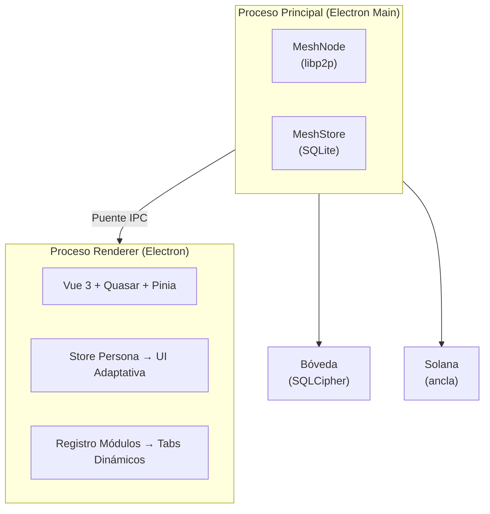
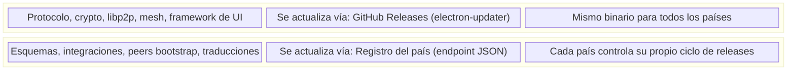
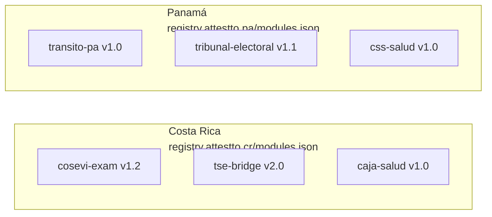

[English](../../README.md) | **[Espanol](./README.es.md)**

---

# Attestto Desktop

**Infraestructura Digital Publica — Identidad Soberana para tu Escritorio**

Attestto Desktop es una aplicacion Electron de codigo abierto que convierte cada computadora en un nodo del mesh nacional de identidad. Ciudadanos, abogados, notarios y funcionarios la usan para gestionar credenciales verificables, firmar documentos y participar en la red de almacenamiento distribuido que mantiene resiliente la infraestructura de identidad.

Cada instalacion contribuye una cantidad configurable de almacenamiento (250 MB por defecto) al mesh peer-to-peer, hospedando datos de identidad cifrados que no puede leer — el principio del **Cartero Ciego**. A cambio, el estado de identidad del usuario se replica en 50+ pares, asegurando disponibilidad aun cuando los servidores del gobierno estan fuera de linea.

---

## Caracteristicas

- **Pantalla de Inicio Adaptativa** — UI guiada por persona que se adapta a roles de ciudadano, legal, salud, educacion, finanzas o gobierno
- **Nodo Mesh P2P** — cada aplicacion de escritorio es un nodo en el mesh de identidad distribuida via [`@attestto/mesh`](https://github.com/Attestto-com/attestto-mesh)
- **Verificacion Offline** — verifica credenciales y documentos firmados sin internet
- **Sistema de Modulos** — instala solo los modulos que necesitas (examen COSEVI, firma de documentos, KYC, etc.)
- **Modulos por Pais** — cada pais publica sus propios modulos independientemente; misma app base, diferentes integraciones
- **Actualizaciones Automaticas** — la app base se actualiza via GitHub Releases; los modulos de pais se actualizan desde sus propios registros
- **Credenciales Verificables** — recibe, almacena y presenta credenciales W3C desde tu boveda local
- **Firma de Documentos** — firma PDFs con firmas basadas en DID ancladas en Solana
- **Privacidad por Diseno** — las llaves privadas nunca salen de tu dispositivo; los datos del mesh estan cifrados de extremo a extremo

---

## Arquitectura



| Capa | Tecnologia | Proposito |
|:-----|:-----------|:----------|
| **Proceso Principal** | Node.js + @attestto/mesh | Red P2P, almacenamiento, criptografia |
| **Renderer** | Vue 3, Quasar, Pinia | UI adaptativa, sistema de modulos, gestion de persona |
| **Boveda Local** | SQLCipher | Llaves privadas, credenciales descifradas, trail de auditoria |
| **Almacen Mesh** | SQLite + archivos .enc | Blobs cifrados de otros ciudadanos (Cartero Ciego) |
| **Ancla** | Solana | Timestamps inmutables de prueba de existencia |

---

## Inicio Rapido

### Prerequisitos

- Node.js >= 20
- pnpm
- [`attestto-mesh`](https://github.com/Attestto-com/attestto-mesh) clonado como directorio hermano

### Instalar y Ejecutar

```bash
# Clonar ambos repos lado a lado
git clone https://github.com/Attestto-com/attestto-desktop.git
git clone https://github.com/Attestto-com/attestto-mesh.git

# Instalar mesh primero (dependencias nativas)
cd attestto-mesh && pnpm install && pnpm build && cd ..

# Instalar y ejecutar desktop
cd attestto-desktop
pnpm install
pnpm dev
```

### Compilar para Distribucion

```bash
pnpm dist:mac     # macOS (.dmg)
pnpm dist:win     # Windows (.exe)
pnpm dist:linux   # Linux (.AppImage)
```

---

## Arquitectura de Actualizacion (Modelo 3: Core + Modulos por Pais)

Attestto Desktop usa un sistema de actualizacion de dos capas disenado para despliegue multi-pais. La app base y los modulos especificos de cada pais se actualizan de forma independiente.



### Como Funciona

Las **actualizaciones del core** son automaticas — la app consulta GitHub Releases al iniciar, notifica al usuario si existe una version nueva, e instala con confirmacion. Sin actualizaciones silenciosas.

Los **modulos de pais** son paquetes independientes almacenados en `{userData}/modules/{moduleId}/`. Cada modulo contiene un `manifest.json` (metadata, version, codigo de pais, hash de integridad) y un `payload.json` (esquemas, configuracion, traducciones). Los paises hospedan su propio registro — un simple endpoint JSON con los modulos disponibles:



### Manifiesto del Modulo

Cada modulo de pais declara:

```json
{
  "id": "cosevi-exam",
  "name": "Prueba Teorica COSEVI",
  "version": "1.2.0",
  "country": "CR",
  "description": "Examen de manejo con proctoring biometrico",
  "author": "MOPT Costa Rica",
  "updatedAt": "2026-04-01",
  "integrity": "sha256-abc123..."
}
```

La app verifica actualizaciones de modulos al iniciar y permite al usuario instalar, actualizar o eliminar modulos del registro de su pais. Un ciudadano costarricense ve los modulos de Costa Rica; un ciudadano panameno ve los de Panama — determinado por el `meshId` y la seleccion en el onboarding.

### Formato del Registro

Los paises publican un arreglo `modules.json` en su endpoint de registro:

```json
[
  {
    "id": "cosevi-exam",
    "name": "Prueba Teorica COSEVI",
    "version": "1.2.0",
    "country": "CR",
    "description": "Examen de manejo con proctoring biometrico",
    "downloadUrl": "https://registry.attestto.cr/modules/cosevi-exam/1.2.0.json",
    "integrity": "sha256-abc123...",
    "updatedAt": "2026-04-01"
  }
]
```

### Modulos Integrados vs Modulos de Pais

La app viene con **modulos integrados** (identidad, credenciales, firma, auditoria) que funcionan en cualquier pais. Son parte del core y se actualizan con el binario de la app.

Los **modulos de pais** extienden la plataforma con funcionalidad especifica de jurisdiccion. Se descargan en tiempo de ejecucion, se almacenan localmente y se actualizan independientemente desde el registro del pais.

| Tipo | Ejemplos | Se actualiza con |
|:-----|:---------|:-----------------|
| **Integrado** | Identidad, Credenciales, Firma, Auditoria | App base (GitHub Releases) |
| **De Pais** | Examen COSEVI, Puente TSE, Citas CCSS | Registro del pais |

---

## Estructura del Proyecto

```
src/
├── main/                    ← Proceso principal de Electron
│   ├── index.ts             ← Entrada, ciclo de vida, registro IPC
│   ├── mesh/                ← Integracion mesh
│   │   ├── service.ts       ← Singleton MeshService (nodo + store + protocolo + GC)
│   │   └── ipc.ts           ← Handlers IPC: mesh:start/stop/status/put/get/tombstone
│   ├── updater/             ← Auto-actualizador del core
│   │   └── core-updater.ts  ← electron-updater via GitHub Releases
│   └── modules/             ← Sistema de modulos por pais
│       └── module-loader.ts ← Instalar/desinstalar/actualizar modulos de pais
│
├── preload/                 ← Puente de contexto (main ↔ renderer)
│   └── index.ts             ← Expone presenciaAPI.mesh, .update, .modules
│
├── shared/                  ← Tipos compartidos entre procesos
│   └── mesh-api.d.ts        ← Tipos del contrato IPC + interfaz PresenciaAPI
│
└── renderer/                ← Aplicacion Vue 3
    ├── views/               ← Paginas (Inicio, Ajustes, Onboarding, Firma, etc.)
    ├── components/          ← Componentes reutilizables
    │   ├── home/            ← Widgets adaptivos del home
    │   └── signing/         ← UI de firma de documentos
    ├── stores/              ← Stores Pinia (persona, mesh)
    ├── types/               ← Manifiesto de modulos, interfaces de persona
    ├── registry/            ← Manifiestos de modulos integrados
    ├── composables/         ← Logica compartida (camara, tracking de actividad)
    ├── router/              ← Vue Router con guardia de onboarding
    └── assets/              ← Estilos (SCSS)
```

---

## Repositorios Relacionados

| Repositorio | Descripcion |
|:------------|:------------|
| [`attestto-mesh`](https://github.com/Attestto-com/attestto-mesh) | Libreria mesh P2P — el motor del almacenamiento distribuido |
| [`did-sns-spec`](https://github.com/Attestto-com/did-sns-spec) | Especificacion del metodo DID para Solana Name Service |
| [`cr-vc-schemas`](https://github.com/Attestto-com/cr-vc-schemas) | Esquemas de Credenciales Verificables para Costa Rica |
| [`attestto-verify`](https://github.com/Attestto-com/verify) | Componentes web de verificacion de documentos (codigo abierto) |
| [`id-wallet-adapter`](https://github.com/Attestto-com/id-wallet-adapter) | Protocolo de descubrimiento de wallets e intercambio de credenciales |

---

## Licencia

[Apache 2.0](../../LICENSE) — Usalo, bifurcalo, desplegalo. Sin dependencia de vendor. Sin permisos necesarios.

Construido por [Attestto](https://attestto.com) como Infraestructura Digital Publica para Costa Rica y el mundo.
